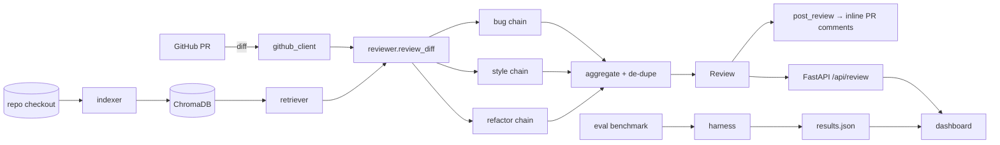

# Agentic Code Review

[Live Demo](https://agentic-code-review.onrender.com/#/dashboard)

An autonomous pull-request reviewer powered by Claude. It decomposes review into three
Chain-of-Thought chains — **bug**, **style**, and **refactor** — grounds them in the
codebase via retrieval (RAG), aggregates and de-duplicates the findings, and posts them
back as inline PR comments. It ships as a GitHub Action, a one-click web demo, and an
execution-based eval harness that measures review quality on a labeled benchmark.

> **Live demo:** paste a public PR URL and get structured findings. Replace the badge
> URL above with your Render URL after deploying.

## What it does

- **Fetches** a PR's unified diff from GitHub.
- **Retrieves** relevant codebase context for each changed hunk from a ChromaDB index
  (biased to the same file, but pulling in cross-file callers/definitions).
- **Reviews** each hunk with three CoT chains that reason step-by-step, then emit
  structured findings (`kind`, `severity`, `file`, `line`, `summary`, `detail`,
  `suggested_fix`).
- **Aggregates** — de-duplicates by `(file, line, kind)`, keeping the highest severity.
- **Posts** a single PR review with inline comments (and a summary body), idempotently.
- **Measures** itself with an execution-based benchmark (does the agent flag the defects
  that actually break tests?).

## Architecture



| Module | Responsibility |
| --- | --- |
| `agent/config.py` | Settings (API keys, model, Chroma dir) from env / `.env` |
| `agent/claude_client.py` | Anthropic SDK wrapper with JSON-repair `complete_json` |
| `agent/indexer.py` · `retriever.py` | Chunk + embed the repo into ChromaDB; retrieve hunk context |
| `agent/chains.py` | The three CoT review chains (`ChatAnthropic`) |
| `agent/reviewer.py` | `review_diff` — orchestrate chains per hunk, aggregate, de-dupe |
| `agent/github_client.py` | Fetch diffs, post idempotent reviews |
| `app/main.py` | FastAPI service + static dashboard |
| `eval/` | Execution-based benchmark + harness |

## GitHub Action

`.github/workflows/pr-review.yml` runs the full pipeline (with RAG) on every PR and posts
a review. Setup:

1. Add repo secret **`ANTHROPIC_API_KEY`** (Settings → Secrets and variables → Actions).
   `GITHUB_TOKEN` is provided automatically.
2. The workflow indexes the checked-out repo, reviews the diff, and posts inline comments.
   Re-runs are idempotent per head commit.

> Posting requires a write-scoped token. PRs from forks run with a read-only token, so the
> post step is skipped there — that's expected GitHub behavior.

## Eval

Execution-based benchmark in `eval/benchmark/` (9 cases: real bug types + style/refactor).
The harness applies each `diff.patch`, confirms the defect breaks tests (green→red), runs
ruff, runs the agent, and scores findings against `labels.json`.

**It makes real Claude calls, so runs are kept small by default.** Recommended first run
(~6 calls, a few cents):

```bash
python -m eval.run --cheap          # 2 bug cases, no fix
python -m eval.run --dry-run        # print the plan + cost estimate, run nothing
python -m eval.run --all --yes      # full benchmark (confirmation required)
```

See [eval usage](#run-the-eval) below for all flags. Example metrics (illustrative sample
in `eval/results.sample.json`; the dashboard renders the real `eval/results.json` once you
run it):

| Scope | Precision | Recall | F1 |
| --- | --- | --- | --- |
| overall | 0.78 | 0.72 | 0.75 |
| bug | 0.86 | 0.80 | 0.83 |
| style | 0.67 | 0.50 | 0.57 |
| refactor | 0.75 | 0.50 | 0.60 |

## Run locally

```bash
python -m venv .venv && source .venv/bin/activate
pip install -r requirements.txt          # full deps (RAG + eval)

cp .env.example .env                      # add ANTHROPIC_API_KEY, GITHUB_TOKEN

# Index a repo, then review a diff from the CLI / Python:
python -m agent.indexer /path/to/repo

# Run the web app (dashboard at http://localhost:8000):
pip install -r requirements-app.txt
uvicorn app.main:app --reload
```

### Run the eval

| Command | What it runs |
| --- | --- |
| `python -m eval.run --cheap` | 2 bug cases, no fix (~6 calls) — **recommended** |
| `python -m eval.run` | first 2 cases, with fix (~6–8 calls) |
| `python -m eval.run --kinds bug,style --limit 3` | filter by kind, cap count |
| `python -m eval.run --no-fix` | skip the (expensive) fix-correctness signal |
| `python -m eval.run --all --yes` | full benchmark (confirmation required) |

## Docker

```bash
docker build -t code-review .
docker run --rm -p 8000:8000 --env-file .env code-review
# dashboard: http://localhost:8000   ·   curl localhost:8000/api/health -> {"status":"ok"}
```

The image uses the lean `requirements-app.txt` (no torch/chromadb). The **hosted demo
reviews diffs without RAG context** (`retrieve=False`) to stay lightweight and read-only;
the GitHub Action uses the full pipeline.

## Deploy (Render)

`render.yaml` is a Render Blueprint. Create a new Blueprint from the repo, then set
`ANTHROPIC_API_KEY` and `GITHUB_TOKEN` in the dashboard (both `sync: false`). Health check
is `/api/health`. Update the Live Demo badge with your service URL.

## API

| Method | Path | Description |
| --- | --- | --- |
| `GET` | `/api/health` | `{"status":"ok"}` |
| `POST` | `/api/review` | `{ "pr_url": "https://github.com/owner/repo/pull/N" }` → `Review` JSON (public repos only, rate-limited, read-only) |
| `GET` | `/api/metrics` | the eval `results.json` the dashboard renders |
